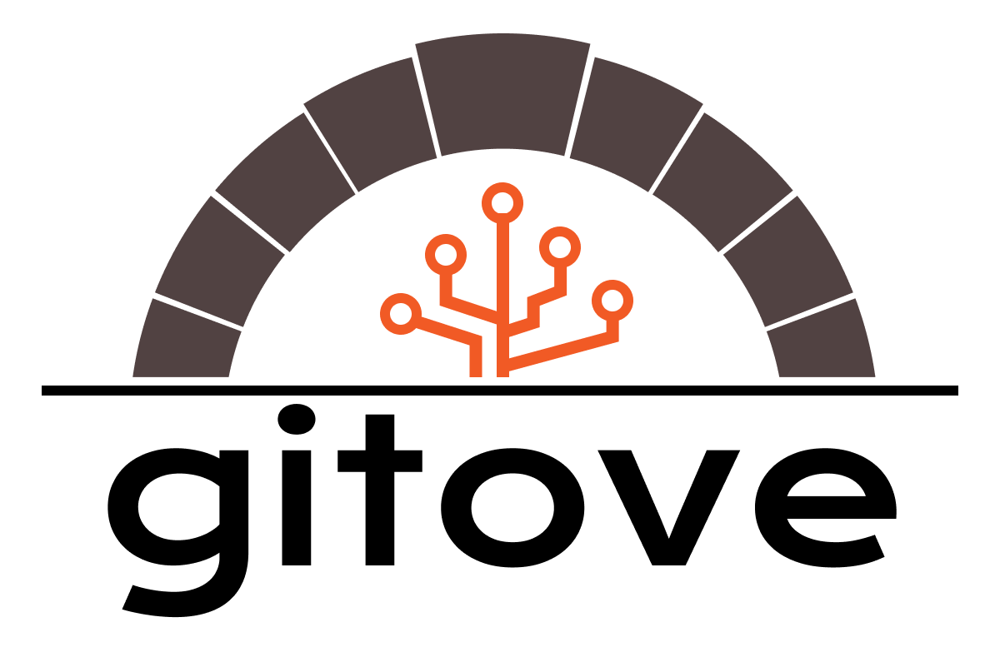

# gitove



[](https://github.com/gitovep/gitove/actions?query=workflow%3ACI+branch%3Amain)
[](https://github.com/gitovep/gitove/blob/main/LICENSE)
[](https://www.npmjs.com/package/gitove)
[](https://www.npmjs.com/package/gitove)

An interactive git cli tool for consistant commit messages.


## Getting Started

### Install

```
$ npm install -g gitove
$ yarn add -g gitove
$ pnpm add -g gitove
```

### Use Example

```
$ gitove c
```

TODO: use example GIF


## Configuration

You can configure your own commit headers by creating `.gitoverc.json`.

```json
{
  // change default setting of commit "type" header
  "default": "string"|"emoji",

  // custom headers for commit "type" header
  // by setting below, it overwrites default headers
  "type": KeywordConfig[],

  // custom headers for commit "scope" header
  "scope": KeywordConfig[],

  // custom keywords for auto replacements
  "replace": KeywordConfig[]
}
```

### KeywordConfig

You can set your own commit headers by providing `KeywordConfig` to configuration file. `KeywordConfig` looks like below.

```json
{
  // the actual message you want it for commit header
  "name": "feat:",

  // an alias to see on header list in cli
  "alias": "feat",

  // a description to see on header list in cli
  "description": "Add new feature."
}
```


### example

```json
{
  "type": [],
  "scope": [],
  "replace": [],
}
```


## Contributing to Gitove
If you want to take part in `gitove`, read the [contribution guide](./CONTRIBUTING.md).


## License

[MIT license](./LICENSE)